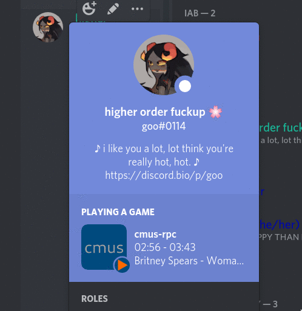

# cmus-rpcd
cmus-rpcd is a small daemon that allows you to display the song you are currently listening to, as well as other information, through Discord's Rich Presence. It automatically refreshes settings, so you do not need to restart the daemon to get changes to your presence. It also comes with lots of customization options for your presence.



## How to use
Installation is quite simple. First, install the following libraries:
* setproctitle
* pypresence
* psutil
</br>

Next, navigate to the directory you would like to install this in, and run the following commands to install the program:
```sh
$ git clone https://github.com/spaceraiders0/cmus-rpcd
$ cd cmus-rpcd
$ sudo ./install -i
```
Now that the program is installed, you can start it by doing:
```sh
$ cmus-rpcd.py --start
```
And you are off. Stop any other rich presence clients, start Discord and Cmus, and you should be able to see your song playing.

## Configuration
cmus-rpcd can be easily customized. It comes with many options to customize the look of your presence. Your settings file is generated automatically by the daemon in the folder you installed it in. Once you launch the program, an ``options.yaml`` file should be created. Inside of it
are all of the options the program can take. They are:
| Setting          | Functionality 				          |  Type   |
|------------------|------------------------------------------------------|---------|
| change_increment | Time interval between status updates.                | Integer |
| state_format     | The string used to format state information.         | String  |
| details_format   | The string used to format details information.	      | String  |
| progress_format  | The string used to format the song progress.         | String  |
| duration_format  | The string used to format the song duration.         | String  |

## Format Specifiers
cmus-rpcd also has format specifiers that can be applied to the state, and the details. They are:
| Specifier     | Meaning                                                 |
|---------------|------------------------------------------------------   |
| {artist}      | The artist of the song.                                 |
| {album}       | The album of the song.                                  |
| {title}       | The title of the song.                                  |
| {status}      | The title of the song.                                  |
| {tracknum}    | The track number of the song.                           |
| {shuffle}     | Whether or not shuffle is on.                           |
| {repeat}      | Whether or not a repeating is enabled.                  |
| {current}     | Whether or not the current song is repeating.           |
| {playlibrary} | Whether or not the song is playing from the library.    |
| {playsorted}  | Whether or not the playing mode is sorted.              |
| {progress}    | Time left in the song. Formatted by progress_format.    |
| {duration}    | Total time of the song. Formatted by duration_format.   |
| {progpercent} | Time left in the song on a percent scale.               |
| {{}           | An escaped opening curly brace.                         |
| {}}           | An escaped closing curly brace.                         |

``state_format`` contains the specifiers for the first RPC line. Let's say you wanted to display the track number, the song name, and the artist in that order. Your ``state_format`` would look like:</br>
``{tracknum}. {title} - {artist}``

# Final parts
And that is it. You can apply the same logic for ``details_format`` as you did for ``state_format``, and past this point, you should be golden. If you find any bugs, feel free to contact me through Discord. My tag is: ``goo#0114``.
